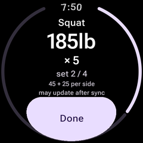
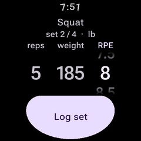
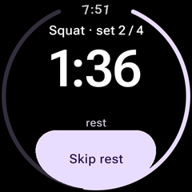
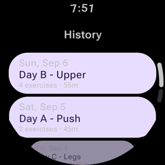
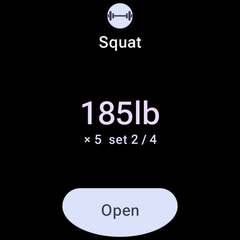
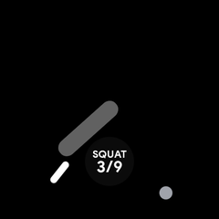

# LiftWear

A standalone **Wear OS** client for [Liftosaur](https://www.liftosaur.com), built for round
Galaxy Watch displays. Start today's workout, see the current set as one large number, confirm
it, get buzzed when rest is up — without pulling your phone out, and without a signal.

> ### This repository was written by an AI
>
> **Every line of code, every test, every commit message and all of the documentation in this
> repository were written by [Claude Code](https://claude.com/claude-code) (Claude Opus 5).**
> Every commit carries the co-author trailer; `git log` is the receipt. A human set the goal,
> made the product decisions, answered the design questions, and said "next phase".
>
> That is the whole point of the repo — the repo name is not a joke — so it is worth being
> precise about what that did and did not mean:
>
> - **The API was reverse-checked, not assumed.** The published docs were wrong or silent in
>   several places, so every endpoint was `curl`ed against the live account before a DTO was
>   written. [`docs/api-findings.md`](docs/api-findings.md) is the result, and one of those
>   findings (set IDs are regenerated per call) changed the architecture.
> - **The bugs that mattered were found by running it, not by writing it.** A notification
>   permission that was declared but never requested, silently dropping every notification. An
>   `OngoingActivity.apply()` call that discarded its own extras with nothing in logcat. A rest
>   countdown that read "3M" for ninety seconds on a real watch face. A rep count crushed to a
>   clipped sliver at large font on a small screen. None of those fail at compile time; all of
>   them are in the git log with the screenshot that caught them.
> - **The worst one needed a real watch.** Both Data Layer listeners were declared with
>   `android:permission="com.google.android.gms.permission.BIND_LISTENER_SERVICE"` — which is
>   what the documentation showed for years. Google Play services on a Galaxy Watch 4 does not
>   hold that permission, so it refused every delivery, and the `SecurityException` landed
>   inside Play services rather than in this app. The phone→watch key hand-off had therefore
>   never worked at all, and it failed in the shape of a flaky Bluetooth link. No emulator, no
>   test and no amount of reading would have caught it; a wrist did.
> - **It was wrong out loud.** At least twice the model asserted something confidently, wrote a
>   test for it, and the test disproved it. Those corrections are in the history too.
>
> If you are evaluating what agentic coding can do: read the commit messages and
> [`CLAUDE.md`](CLAUDE.md) rather than the diffs. The reasoning is the interesting part.

**This is an unofficial third-party client.** It is not affiliated with, endorsed by, or
supported by Liftosaur, and it deliberately uses none of Liftosaur's branding, logo or package
namespace. The API could change without notice; the client sends a versioned
`X-Liftosaur-Client` header so breakage is attributable to a build.

---

## What it looks like

| Workout | Set confirm | Rest | Ambient |
|---|---|---|---|
|  |  |  |  |

| History | Tile | Complication |
|---|---|---|
|  |  |  |

All screenshots use invented sample data.

## What it does

- **Workout execution** — today's plan, one focus card per exercise, swiped horizontally. The
  weight is the largest thing on screen because it is what you check while re-racking.
- **Set logging through a picker.** Never one-tap. Two interactions for a normal set, and it is
  genuinely hard to mislog. AMRAP, ask-weight and RPE sets open with the required field focused
  and empty, because the API rejects them otherwise.
- **A rest timer that survives the app being closed.** Exact alarms rather than a coroutine
  delay, a foreground service, and an Ongoing Activity chip the system animates on the watch
  face. A soft tap ten seconds out, three firm pulses at zero — different *shapes*, so they are
  distinguishable through a sleeve. No auto-advance, ever.
- **Full offline logging.** Every tap writes to a local database and returns immediately; a
  durable outbox sends when there is signal. Sets logged in a basement survive a force-stop.
- **History browsing**, parsed from the Liftoscript text the API actually returns.
- **All four Wear surfaces** — Tile, Ongoing Activity, ambient mode, and a watch face
  complication.
- **A phone companion** whose only job is to hand the watch your API key over the Data Layer,
  then delete it.

### Honest limitations

- **A Liftosaur Premium subscription is required.** The API is inert without one, and the app
  says so plainly rather than showing a generic error.
- **You must be online to *start* a workout.** `/workout/next` regenerates its set IDs on every
  call, so a prefetched plan refers to nothing — proven, not inferred. Everything after the
  start is fully offline, which covers the real failure case: signal dying once you are inside
  the gym.
- **No heart rate, no sensors, no Health Services.** By design. The app reads nothing about
  your body.
- **Not on the Play Store.** Sideload it — see [Install](#install). Play distribution would
  additionally require swapping `USE_EXACT_ALARM` for `SCHEDULE_EXACT_ALARM` with a runtime
  consent flow, and a `specialUse` foreground-service justification at review.

## Requirements

- Wear OS 4 or newer (API 33+), round display.
- A Liftosaur Premium API key (`lftsk_…`).
- An Android phone, only to hand the key across — after that the watch is standalone.

Verified end to end on a **Galaxy Watch 4 (SM-R860, Wear OS 6, 396×396)**, and on 396×396
Wear OS 4 and 454×454 Wear OS 6 emulators at font scales 1.0 and 1.24.

To build it yourself you also need the Android SDK with platform 37 and build-tools 37, and
JDK 21.

## Install

Signed APKs are attached to each [release](../../releases/latest). **Install both** — the
phone app is how your API key reaches the watch, and the two must come from the same release
because the Wearable Data Layer refuses to pair apps whose signing certificates differ.

```sh
adb install-multiple -r liftwear-wear-<version>.apk liftwear-wear-<version>.dm   # to the watch
adb install -r liftwear-phone-<version>.apk                                      # to the phone
```

The `.dm` beside the watch APK is its baseline profile. A plain `adb install` of the APK alone
works, but the watch then runs the app uncompiled until it next sits idle on the charger — on
a Galaxy Watch 4 that measured 14% janky frames scrolling Home, against 3–5% compiled. The two
files must keep the same name.

Sideloading to a watch needs ADB debugging and Wireless debugging (two separate toggles) under
Developer options, then `adb pair <ip>:<port>` and `adb connect <ip>:<port>`.

Open LiftWear on the watch once first — a freshly installed app cannot receive anything until
it has been launched. Then open LiftWear on the phone, paste your key, and tap **Send to
watch**. The watch stores it and acknowledges, and the phone deletes the key from the
connection. If you would rather not install the phone app, Setup on the watch keeps manual
entry one tap away.

## Build

```sh
./gradlew :wear:assembleDebug :mobile:assembleDebug
adb install -r wear/build/outputs/apk/debug/wear-debug.apk
```

Release builds are signed from `~/.config/liftwear/keystore.properties`, which is deliberately
outside the repo — a signing key is not recoverable, and losing it means no later build can
upgrade an existing install. Without that file `assembleRelease` still builds, just unsigned,
so a fresh clone is not blocked.

Development commands, module layout and the design invariants are in
[`CLAUDE.md`](CLAUDE.md).

## State of things

162 unit tests and 61 instrumented tests, green on both a 396×396 Wear OS 4 emulator and a
454×454 Wear OS 6 emulator, at font scales 1.0 and 1.24.

It has since run on a real Galaxy Watch 4 (Wear OS 6), where 61/61 instrumented tests passed
and every gap that only hardware could close was closed:

- **The rest timer is exact in Doze.** Sealed in forced deep idle with no debugger contact
  across the deadline, two alarms ten seconds apart fired **+15 ms** and **+3 ms** off target.
  `setExactAndAllowWhileIdle` is documented as rate-limited to roughly once per nine minutes
  in Doze; it is not, here, and the second alarm surviving is what proves it. The
  `setAlarmClock` fallback was never needed.
- **Running it on hardware found real bugs**, as usual — three of them, all silent. The watch
  had no way to pick up an API key the phone published while it happened not to be listening,
  and the phone's own on-screen advice told you to do the one thing that could not help. Worse,
  both Data Layer listeners were declared with a bind permission that Google Play services does
  not hold on this watch, so every delivery was refused with nothing in the app's logs — the
  key could not arrive while the app was closed, and the phone never processed the
  acknowledgement that tells it to delete the key from the connection.
- **Ambient mode owns the screen.** Wear OS 6 keeps the app on screen in ambient whether or
  not it asks to be, and the watch confirmed what the emulator had shown. The burn-in orbit
  walk still has not run anywhere: this watch sets `sys.burn_in_protection.enabled=1` in
  system properties but reports
  `isBurnInProtectionRequired=false` to the app, and only the latter is what the code reads.
- **The key hand-off works end to end**, including the deletion of the credential from the
  Data Layer once the watch acknowledges it — a security property that until now had only
  ever been tested against a fake transport.
- **Offline logging holds up.** Five sets logged in airplane mode landed on the server
  exactly once when connectivity returned, with the queued finish draining *after* its sets
  rather than overtaking them.

Every test ran against a disposable program that is deleted afterwards; the account is
verified back to its exact prior state.

## A note on the training data

The repo is public and the development account is a real one, so `fixtures/`, `backups/` and
the test-record scratch file are gitignored. Every committed fixture, test sample and
screenshot uses invented weights, exercises and program names.

## License

[MIT](LICENSE).
